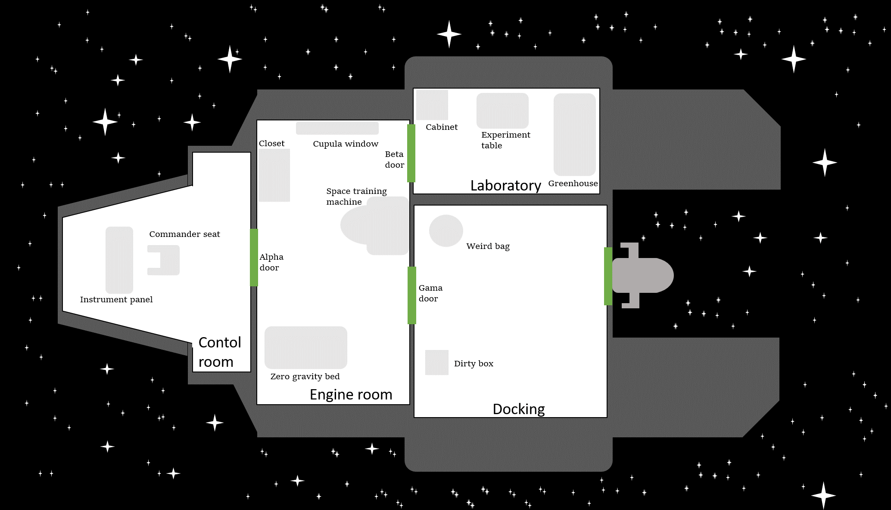

# Project: Escape Room Python Game

### Watch the game demo here: https://vimeo.com/685458077 

# Before starting! Game pre-requisites

### For windows users:

- Download the repo with "git clone https://github.com/parisisergio/Escape_Room.git" on your command line. Make sure to do "cd Escape_Room/your-code" before continuing.

- Check if you have python installed by typing python on your windows command line (not git bash command line). Check if you have the last version of windows terminal here: https://www.microsoft.com/store/productId/9N0DX20HK701. Use exit() to exit the python ecosystem. If you have any errors, install python on your computer (directly from the python official documentation, not from microsoft store). 

- Check after installing python if you have *pip* by running "pip --version". If it doesn't work, run "python get-pip.py" on your command (find it in Escape_Room) line to install pip install for installing packages. 

- Run "pip install emoji" and "pip install pygame"

- Do "cd Escape_Room/your-code" and run "python main.py"

- Enjoy!

- Make sure you've installed everything con the same path before launching the game. If you see that some imported module throws errors like if you've never installed (but you actually did) it might be because you are installing them on different paths from the one on the game. Check this https://stackoverflow.com/questions/14295680/unable-to-import-a-module-that-is-definitely-installed 

- If you have a error  similar to "Failed loading libmpg123-0.dll", follow the steps to fix it in this stack overflow question: https://stackoverflow.com/questions/59623969/pygame-error-failed-loading-libmpg123-dll-attempt-to-access-invalid-address - You have the libmpg123-0.dll file in your Escape_Room folder for you to move it. Run "pip unistall pygame" and "pip install pygame". Close everything and restart from step 4.

### For mac users:

- Download the repo with "git clone https://github.com/parisisergio/Escape_Room.git" on your command line. Make sure to do "cd Escape_Room/your-code" before continuing.

- Check if you have python installed by typing python3 on your command line. Use exit() to exit the python ecosystem. If you have any errors, install python on your computer.

- Check after installing python if you have *pip* by running "pip --version". If it doesn't work, run "python get-pip.py" on your command (find it in Escape_Room) line to install pip install for installing packages. 

- Run "pip install emoji" and "pip install pygame"

- Do "cd Escape_Room/your-code" and run "python3 main.py"

- Enjoy!

- Make sure you've installed everything con the same path before launching the game. If you see that some imported module throws errors like if you've never installed (but you actually did) it might be because you are installing them on different paths from the one on the game. Check this https://stackoverflow.com/questions/14295680/unable-to-import-a-module-that-is-definitely-installed 

## Overview

The goal of this project is for you to apply the Python programming skills you have learned this week in solving a real problem. We present you the design of a classic game that can be played via text - Escape Room. Your goal is to develop the game using Python based on the game design.

Read the game narratives and technical requirements carefully. Plan how you will achieve your goal with pseudo codes and/or flowchart. Review the logic and process in order to avoid potential errors. Then implement with Python code. After that, test your code several times with different inputs and make sure it's rock solid. The instructional team is standing by to help you in case you run into any problems.

---

## Game Design

### Game Map

### Game Narratives

#### Control Room

You are the captain of the spaceship Battlestar and the spaceship is about to collide with an asteroid and it is inevitable. You have to escape in the space shuttle and you have 2 minutes. 

Don't forget to take everything you need to escape!!!.

You are now in control room.

What would you like to do?

You explore the room. This is Control Room. You find: Commander Seat, Instrument Panel, Alpha Door.

You examine instrument panel. You find Galactic GPS keep it safely, you would be lost without it! 

You examine Alpha Door. It is locked but you don't have the key.

You examine Commander Seat. You find Access Card Alpha.

You examine Alpha Door and unlock it with the access card you just found.

Do you want to go to the next room?

#### Engine Room

You are now in Engine Room. What would you like to do?

You check inventory. You have collected Access Card Alpha and Galactic GPS. Better keep moving.

You explore the Engine Room. You find: Cupola Window, Zero Gravity Bed, Space Training Machine, 

Closet, Beta Door, Gamma Door, Alpha Door.

You examine Zero Gravity Bed. You find your dog Astro – Uff, thank goodness I found you! We have to get out of the spaceship soon, let's go!!!

You examine Cupola Window. There isn’t anything interesting about it.

You examine Space Training Machine. You find Access Card Beta.

You examine Closet. You find my best friend Android-55FX. It could have been a better photograph but there is no time to look any further.

You examine Beta Door. Your unlock it with an access card you have.

Do you want to go to the next room?

#### Laboratory

You are now in the Laboratory. What would you like to do?

You explore the room. You find: Cabinet, Experiment Table, Greenhouse, Beta Door.

You examine Cabinet. You find Fuel. It's not a lot of fuel, but it will at least help me escape.

You examine Greenhouse. You find Space Card.

You examine Experiment Table. You find Access Card Gamma.

You examine Gamma Door. Your unlock it with an access card you have.

Do you want to go to the next room?

#### Docking Room

You are now in Docking Room. What would you like to do?

You explore the room. You find: Gamma Door, Space Door, Dirty Box, Weird Bag

You examine Dirty Box. You find Lady Gaga Physical Album - Fortunately I found it, I will listen to it once I manage to escape!

You examine Weird Bag. You find Huggable Bear. I can't sleep without him, he can't stay on the spaceship.

You examine Space Door. Your unlock it with an access card you have.

Do you want to go to the next room?

#### Space 

Congrats! You escaped from the spaceship! 

---

## Getting Started

Overwhelmed and don't know where to start? This is a tough challenge we know. But don't worry. We have included a working example for you to reference in which only 1 room (game room) is included. Read the example and make sure you understand it. Then you can expand on top of the example to code the rest of the rooms.

The provided example is just a Minimal Viable Product (MVP). It is fully functional but not bullet proof. You should be aware of its limitations while you are working and try to make your final product as robust as possible.

## Technical Requirements

* Use Python lists and dictionaries to define the rooms, items, and relations of them.

* Use a Python dictionary to store the game state. Update the state dictionary when progresses are made such as a key is collected.

* Use Python functions to play the game. Don't use procedural code.

* After completing each game action, call the next function to continue playing until the winning condition is reached.

* The winning condition is for the player to successfully make to the "Outside" room. When this happens, congrat the player and end the game.

## Necessary Deliverables

The following deliverables should be pushed to your Github repo.

* `main.ipynb` that contains your solution.

## Suggested Ways to Get Started

1. Start Jupyter Notebook from this lab directory.

1. Launch `sample-code.ipynb` and read through the file. Also execute the code and play the game. Make sure you understand what each line of the codes does.

1. Create `main.ipynb` and copy the codes from `sample-code.ipynb`. Expand the code following the example to create Bedroom 1.

1. Test the game with Game Room and Bedroom 1. Make sure everything works then work on Bedroom 2 then Living Room.

1. Test the whole game. Try to make all kinds of inputs to make sure your game is rock solid and will not break.
